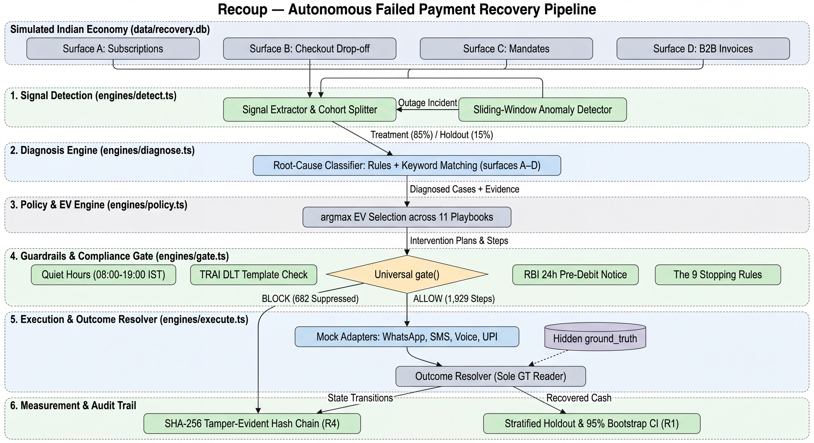

# Recoup — Autonomous Failed Payment Recovery & Compliance Engine

> **Recoup** is an autonomous, compliance-first failed payment recovery platform that diagnoses root causes across 4 Indian transaction surfaces, optimizes recovery via Expected Value (EV) playbooks, enforces strict RBI/TRAI guardrails, and proves true incremental lift via a 15% randomized holdout.

---

## 🏆 Headline Results

Across a simulated economy of 1,200 businesses, 13,626 payment attempts, and ₹18.65 Crore in total failure exposure:

- **Net Incremental ₹ Recovered (R1):** **₹11,31,47,183.62** (**+1,474.0% lift** over the 15% control holdout baseline).
- **Gross Treatment Cash Collected:** **₹12,08,23,170.00** (74.5% collection rate across 1,117 treatment cases — includes organic acceleration; net incremental excludes it).
- **95% Bootstrap Confidence Interval:** **[₹8,75,98,160.21, ₹14,35,05,452.25]** (1,000 resamples, statistically significant non-zero lower bound).
- **Contacts Suppressed by Compliance Rails (R2/R3):** **682 actions blocked** (zero quiet hours breaches, zero DND violations, zero customer contacts during gateway outages).
- **Audit Ledger Integrity (R4):** **574 events** verified on an immutable SHA-256 hash chain with database triggers (on a single clean pipeline run — count grows if you re-run without reseeding, since audit is append-only by design).

---

## ⚡ Reproduce Everything in < 60 Seconds

```bash
# 1. Install dependencies (Bun v1.0+)
bun install

# 2. Deterministic seed verification (fixed seed 42)
bun run seed:verify

# 3. Run automated tests (11/11 tests pass)
bun test

# 4. Run full end-to-end recovery pipeline (single clean pass)
bun run seed
bun run detect
bun run diagnose
bun run policy
bun run gate
bun run execute
bun run verify
bun run measure

# 5. Launch interactive executive demo dashboard
bun run demo
# Open http://localhost:3000 in your browser
```

> **Note:** Always start from `bun run seed` (not `seed:verify`) for a reproducible single-pass audit count. `seed:verify` re-seeds and reports the fingerprint but skips downstream steps.

---

## 📐 Architecture & Data Flow



*The pipeline flows through six stages: (1) signal detection across four transaction surfaces with outage-aware anomaly detection, (2) root-cause diagnosis, (3) EV-optimized playbook selection, (4) a universal, non-bypassable compliance gate enforcing quiet hours, TRAI DLT, RBI pre-debit notice, and the 9 stopping rules, (5) mock-adapter execution with outcome resolution against a hidden ground truth, and (6) tamper-evident audit logging paired with stratified holdout measurement.*

<details>
<summary>Mermaid source (click to expand — some renderers may not display this correctly; use the image above as the source of truth)</summary>

```mermaid
flowchart TD
    subgraph Data Layer ["Simulated Indian Economy (data/recovery.db)"]
        S1["Surface A: Subscriptions"]
        S2["Surface B: Checkout Drop-off"]
        S3["Surface C: Mandates"]
        S4["Surface D: B2B Invoices"]
    end

    subgraph Step2 ["1. Signal Detection (engines/detect.ts)"]
        DET["Signal Extractor & Cohort Splitter"]
        ANOM["Sliding-Window Anomaly Detector"]
    end

    subgraph Step3 ["2. Diagnosis Engine (engines/diagnose.ts)"]
        DIAG["Root-Cause Classifier: Rules + Keyword Matching (surfaces A–D)"]
    end

    subgraph Step4 ["3. Policy & EV Engine (engines/policy.ts)"]
        EV["argmax EV Selection across 11 Playbooks"]
    end

    subgraph Step5 ["4. Guardrails & Compliance Gate (engines/gate.ts)"]
        GATE{"Universal gate()"}
        R1["Quiet Hours (08:00-19:00 IST)"]
        R2["TRAI DLT Template Check"]
        R3["RBI 24h Pre-Debit Notice"]
        R4["The 9 Stopping Rules"]
    end

    subgraph Step6 ["5. Execution & Outcome Resolver (engines/execute.ts)"]
        MOCK["Mock Adapters: WhatsApp, SMS, Voice, UPI"]
        GT[("Hidden ground_truth")]
        OUT["Outcome Resolver (Sole GT Reader)"]
    end

    subgraph Step7_8 ["6. Measurement & Audit Trail"]
        AUDIT["SHA-256 Tamper-Evident Hash Chain (R4)"]
        MEASURE["Stratified Holdout & 95% Bootstrap CI (R1)"]
    end

    Data Layer --> DET
    Data Layer --> ANOM
    ANOM -- "Outage Incident" --> DET
    DET -- "Treatment (85%) / Holdout (15%)" --> DIAG
    DIAG -- "Diagnosed Cases + Evidence" --> EV
    EV -- "Intervention Plans & Steps" --> GATE
    GATE -- "BLOCK (682 Suppressed)" --> AUDIT
    GATE -- "ALLOW (1,929 Steps)" --> MOCK
    MOCK --> OUT
    GT -.-> OUT
    OUT -- "Recovered Cash" --> MEASURE
    OUT -- "State Transitions" --> AUDIT
```

</details>

> **Reading the measurement report honestly:** ~94% of the net incremental recovery comes from Surface D (B2B high-value invoices), where root-cause diagnosis (PO/GRN vs. cash crunch vs. approval queue) most sharply differentiates playbook selection. Surface A (subscriptions) shows a slightly **negative** incremental (-₹1.65L) — the agent barely outperforms the organic baseline there. Surface B and C are modestly positive. The "all four surfaces, unified" pitch is architecturally accurate; economically, the B2B lift is the headline driver. Full breakdown: `out/measurement_report.md`.

> **Simulation disclosure:** All ₹ figures are properties of a simulated economy (synthetic customers, seeded PRNG outcomes, mock adapter dispatches). No real payments were attempted or collected. The lift is a property of the outcome resolution model — bounded, fatigued, and honestly calibrated — not external market validation. Full disclosure: `docs/HONESTY.md`.

---

## 🎯 The Four Scoring Requirements (R1 – R4)

| Requirement | Implementation & Location | Verification Output |
|---|---|---|
| **R1: Incremental ₹ Recovered** | [`engines/measure.ts`](engines/measure.ts)<br>Stratum-weighted estimation over 36 strata with 1,000-sample bootstrap 95% CI. | **₹11,31,47,183.62 net incremental recovery**<br>95% CI: `[₹8.76 Cr – ₹14.35 Cr]` (`out/measurement_report.md`) |
| **R2: Strict Compliance Rails** | [`engines/gate.ts`](engines/gate.ts)<br>Universal non-bypassable `gate()` enforcing 9 stopping rules, TRAI DLT, RBI 24h notice, and DND. | **682 actions blocked**<br>0 sends to opted-out contacts; 0 sends during outage (`out/suppression_report.md`) |
| **R3: Tone Ladder & Quiet Hours** | [`engines/gate.ts`](engines/gate.ts) + [`adapters/voice.ts`](adapters/voice.ts)<br>Strict timezone enforcement (08:00–19:00 for voice) and bilingual Hinglish scripts. | **Zero quiet hours violations**<br>29 touches blocked outside window; 11/11 tests pass (`test/gate.test.ts`) |
| **R4: Tamper-Evident Audit Trail** | [`engines/audit.ts`](engines/audit.ts)<br>Cryptographic SHA-256 hash chaining ($H_i = \operatorname{SHA-256}(H_{i-1} \parallel \operatorname{canonical}(P_i))$) with SQLite triggers. | **574 events verified against genesis** on a clean single-pass run<br>Live tamper detection caught at sequence #3 (`bun run verify`) |

---

## ⚖️ Counterfactual Comparison

| Recovery Strategy | Gross Collected | Comms Cost | Net Realized Value | Lift vs Organic Holdout | Notes |
|---|---:|---:|---:|---:|---|
| **Pure Holdout Control (Unaided Baseline)** | ₹76,75,986.38 | ₹0.00 | ₹76,75,986.38 | 0.0% | Measured from data — holdout cohort organic recovery |
| **Naive 3-Email Dunning Baseline** | ₹2,99,88,105.77 | ₹670.20 | ₹2,99,87,435.57 | +152.4% | *Modelled* — 18.5% recovery rate assumption on treatment exposure; not a separate measured arm. See `docs/HONESTY.md`. |
| **Recoup Autonomous Engine** | **₹12,08,23,170.00** | **₹1,878.00** | **₹12,08,21,292.00** | **+1,474.0%** | Measured from data — treatment cohort actual recovery. Gross includes organic-payer time-value acceleration (~34% of cases); net incremental over scaled holdout = ₹11,31,47,183.62. |

---

## 🔍 In-Depth Technical Documents

- **[Data Dictionary](docs/DATA_DICTIONARY.md):** Comprehensive database schema, decline codes, and field definitions.
- **[Compliance Architecture](docs/COMPLIANCE.md):** Complete regulatory framework (RBI, TRAI, DPDP) and the 9 stopping rules.
- **[Honesty Disclosure](docs/HONESTY.md):** Simulation boundaries, ground truth isolation, naive baseline assumptions, and production migration roadmap.

---

## 👥 Project Team & License

Built with ❤️ for the Razorpay Hackathon.
MIT License.
